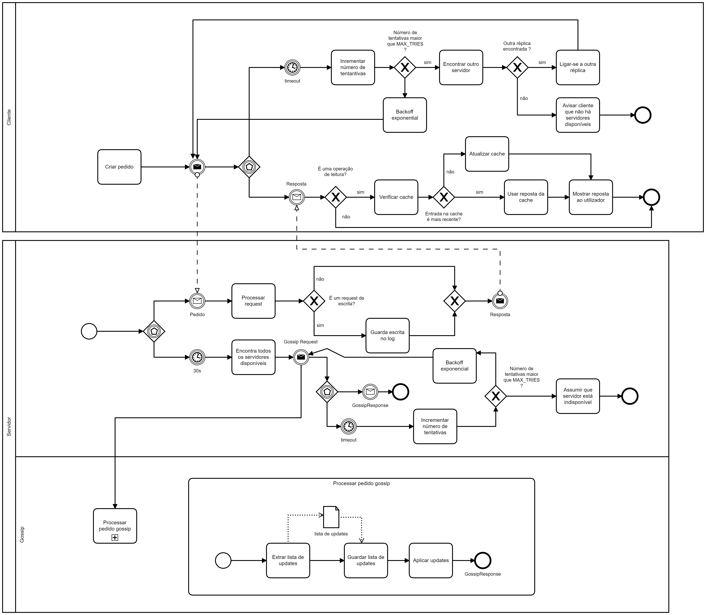

#  Relatório do projeto Sauron

  

Sistemas Distribuídos 2019-2020, segundo semestre

  
  

##  Autores

  

**Grupo A36**

  
  

##  POR MAILS NA TABELA

  

| Número | Nome          | Utilizador                                        | Correio                       |
|:------:|---------------|---------------------------------------------------|-------------------------------|
|  89470 | João Coutinho | [jafonsoc](https://github.com/jafonsoc)           | [j.afonso.coutinho@tecnico.ulisboa.pt](mailto:j.afonso.coutinho@tecnico.ulisboa.pt)                         |
| 89472  | João Porto    | [stopitcarl](https://github.com/stopitcarl)       |[joaofporto@tecnico.ulisboa.pt](mailto:joaofporto@tecnico.ulisboa.pt) |
| 89512  | Miguel Neves  | [BolachasDaAvo](https://github.com/BolachasDaAvo) | [miguelscfneves@tecnico.ulisboa.pt](mailto:miguelscfneves@tecnico.ulisboa.pt)             |

  

  

  
  

##  Melhorias da primeira parte

- Adicionados comentários para melhorar a legibilidade do código. [commit](https://github.com/tecnico-distsys/A36-Sauron/commit/c7214e92e4949fb6dd575b0a6c776adfd7bcdcb0)
- No protocolo silo.proto, mudou-se o _type_ dos reports de _string_ para _enum_. Otimizando assim as mensagens de report. [commit](https://github.com/tecnico-distsys/A36-Sauron/commit/64b1afa18c9217f4cd4239fd524688e4570c27c4)
- Melhorias no demo [commit](https://github.com/tecnico-distsys/A36-Sauron/commit/2b8dcaad9850ef60ac7cc4c9947e3a94ec5593ea)
- Adicionados novos testes ao CamJoin para melhorar a cobertura [commit](https://github.com/tecnico-distsys/A36-Sauron/commit/23b47334cd935531440a76a8ee6c02c9eda1955b)
  
  

##  Modelo de faltas

**Faltas toleradas:**

 * Cliente:
	* Perder conexão temporária com o servidor.
   
	* Servidor ao qual está ligado deixar de disponível.
   
	* Servidor responder com uma cópia mais antiga do que a cliente já viu.

 * Servidor:

	* Receber o pedido de registo de uma câmara que já está registada.

	* Perder conexão temporária com outros servidores

	* Um servidor com qual está a falar deixar de estar disponível.

  

**Faltas não toleradas:**
* Cliente:
	* Cache não tem limite. Assume-se que a vida útil do cliente não será longa o suficiente para tornar a cache insuportável na memória.

 * Servidor:

	* Perda de conexão superior a um GOSSIP_TIME (30s). Servidor assume-se indisponível e não conseguirá recuperar gossips perdidos.

	* Perda de informação em memória. Não há protocolo de persistência, se o servidor recomeçar, mesmo que o tempo de restart seja inferior a um GOSSIP_TIME, não irá recuperar informação perdida.

##  Solução

  

Um cliente ao ser iniciado, liga-se a uma das réplicas do servidor de forma aleatória, a não ser que lhe seja fornecido um número de instância. Em qualquer tipo de troca de mensagens, se a réplica que está a ser contactada não responder dentro de um _timeout_ pré-definido, o cliente utiliza uma técnica de backoff exponencial até obter resposta. Caso a réplica envie reposta após um certo número de tentativas, o cliente liga-se a outra réplica, escolhida aleatoriamente, e reenvia o pedido. Ao realizar uma leitura, o cliente guarda numa _cache_ o par pedido/resposta e sempre que receber uma nova leitura, compara os timestamps vetoriais do pedido recebido com aquele guardado em cache, mostrando ao utilizador aquele que for mais recente.
Do lado do servidor,no caso de uma escrita (i.e. registo da camara, report, etc...), os dados são guardados na réplica contactada, sendo estes propagados mais tarde,  para todas as réplicas disponíveis, por gossip.

  
  

##  Protocolo de replicação

  

O protocolo de replicação utiliza a arquitetura _gossip_ e timestamps vetoriais para manter a coerência entre réplicas. Cada réplica guarda um _log_ de todas as escritas feitas desde o último _gossip_. O _log_ está dividido em duas listas, uma com _reports_ e outra com _camJoins_. Sempre que é efetuado um _gossip_ o _log_ é limpo de modo a não enviar informação repetida em _gossips_ seguintes. Ao receber _gossip_, a réplica percorre ambas as listas e aplica as escritas no seu domínio, atualizando o seu timestamp vetorial no processo.

  

A mensagen de gossip - _GossipRequest_ - trocada entre réplicas são compostas por duas listas - _camJoins_ e _reports_ - e um timestamp vetorial - _ts_. A lista de _camJoins_ é composta pelos pedidos _CameraRegistrationRequests_ efetuados pelo cliente quando este registou as câmaras.
A lista de _reports_ é composta pelos pedidos _ReportRequests_ efetuados pelo cliente, com a adição do timestamp calculado pela réplica no momento em que os recebeu.
O timestamp vetorial _ts_ corresponde ao timestamp do servidor que envia a mensagem.
A mensagem de gossip é enviada a cada 30 segundos para todas as outras réplicas. Antes de enviar a mesnagem _gossip_, o servidor obtém a lista de réplicas disponíveis do _ZooKeeper_ e para cada réplica tenta enviar um _GossipRequest_.
Para cada réplica, se o servidor não conseguir obter reposta dentro de um tempo predefinido, tenta de novo, aplicando um backoff exponencial.
Após o número de tentantivas exceder o configurado, o servidor assume que a réplica a contactar está indiponível permanentemente e não voltará a estar disponível.

  

##  Opções de implementação

  

Só é efetuado _gossip_ caso a réplica tenha informação que ainda não propagou. Caso não tenha nada a propagar, o servidor esperará mais 30s antes de tentar fazer um _gossip_ de novo.
Caso uma das listas de escritas (_report_ ou _camJoin_) esteja vazia, em vez de adicionar uma lista vazia à mensagem, esta é ignorada. Fazendo com o método _build()_ crie uma mensagem mais pequena.
